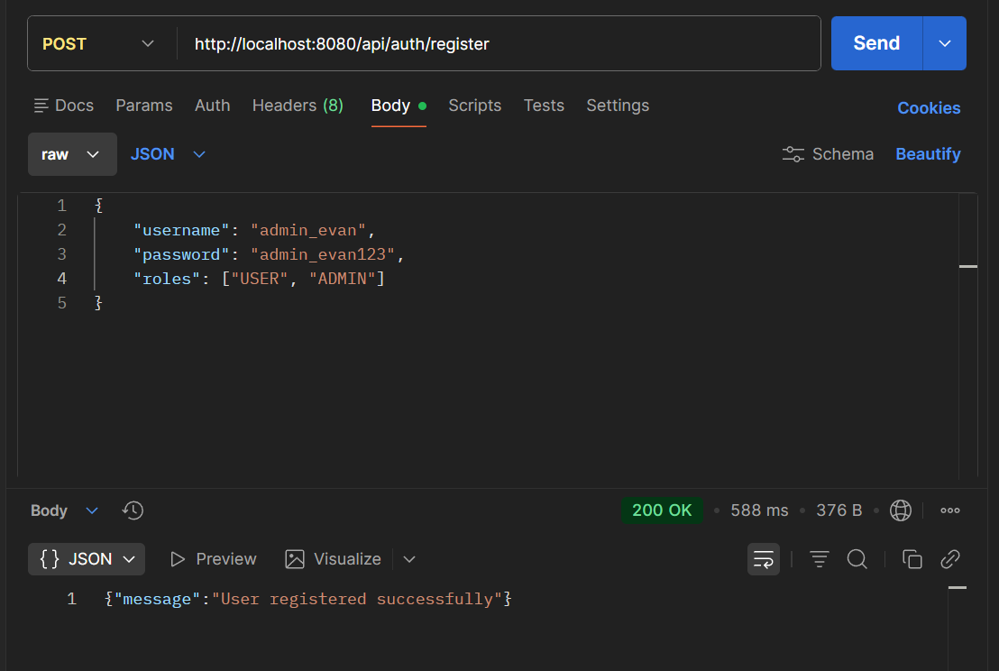
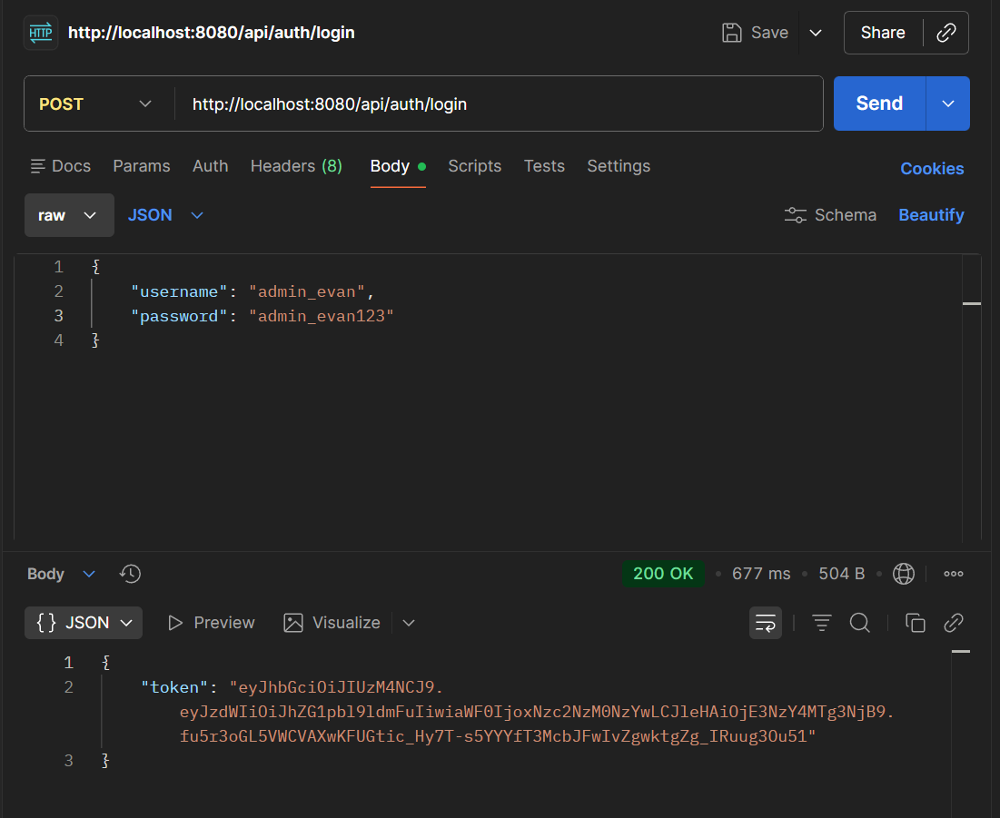
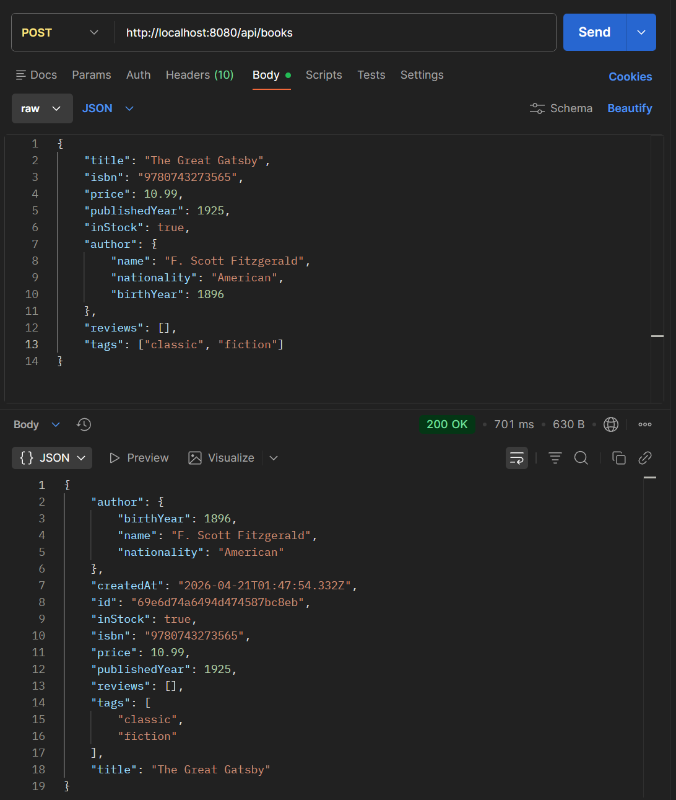
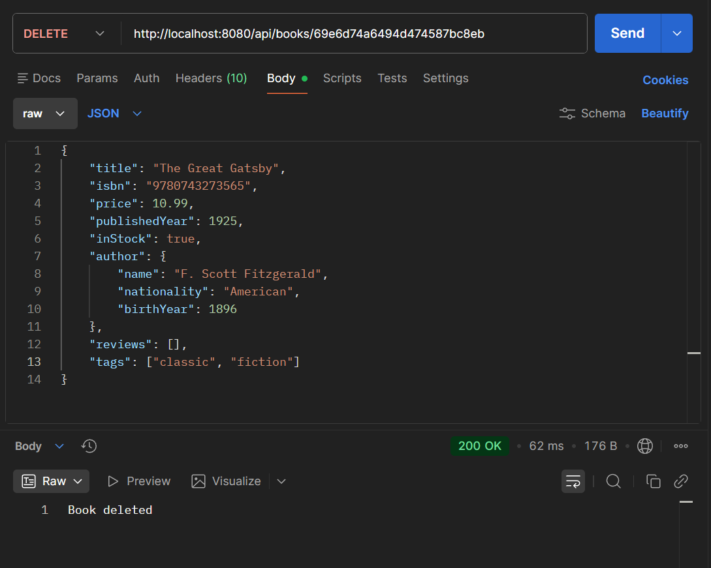
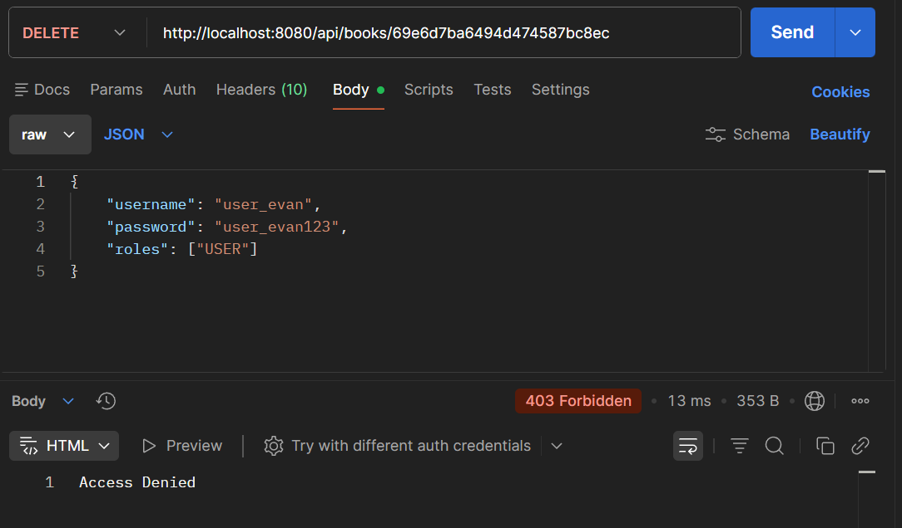

### ASSIGNMENT 2 — JWT Role-Based Authorization

## 1. Register the ADMIN user (200 OK response)

## 2. Login as ADMIN and token visible in response

## 3. DELETE request as ADMIN — 200 OK with success message

## 4. DELETE request as USER — 403 Forbidden response

